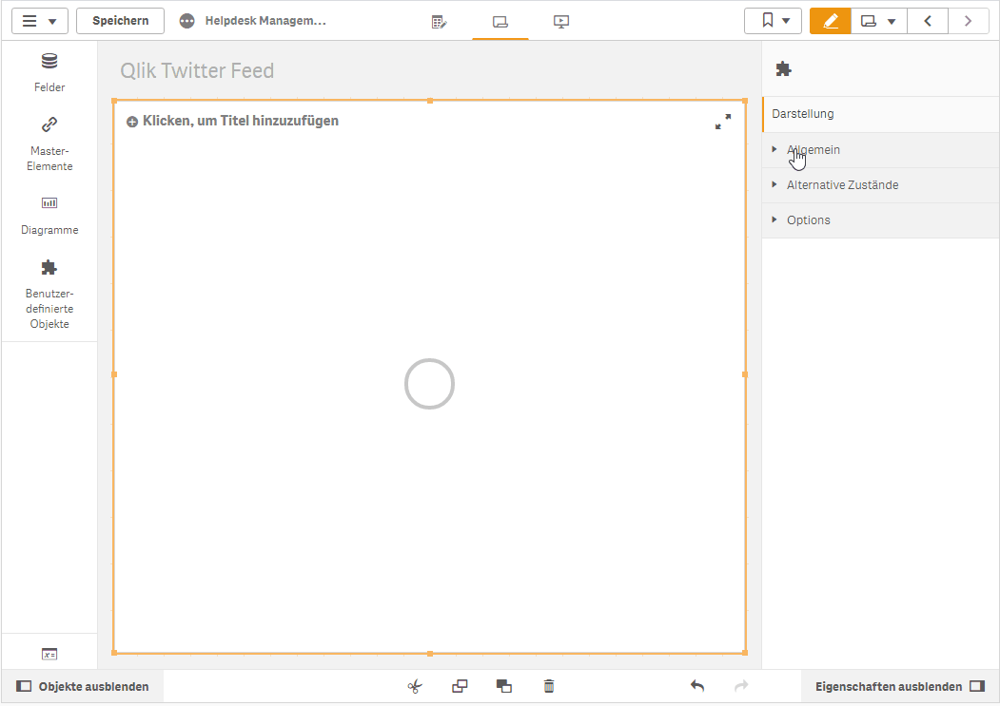

Qlik Sense Extensions RSS Reader
================================

*RSS is dead, long live RSS!*

This simple extension pulls data from an RSS feed (in XML format) and renders it as a list. You can use the style sheet to adjust the layout to meet your taste.

Since most RSS sites will give you a CORS error in the browser, you will need a proxy in between. An example proxy can be found here:

[https://cors-anywhere.herokuapp.com/](https://cors-anywhere.herokuapp.com/)

But, don't use this in production!

## Author

**Ralf Becher**

* [irregular.bi](http://irregular.bi)
* [twitter/irregularbi](http://twitter.com/irregularbi)
* [github.com/ralfbecher](http://github.com/ralfbecher)

## License

Copyright © 2020 Ralf Becher

Released under the MIT license.

***